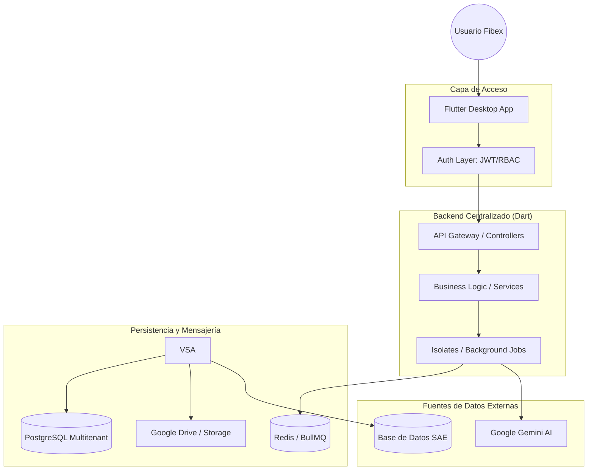
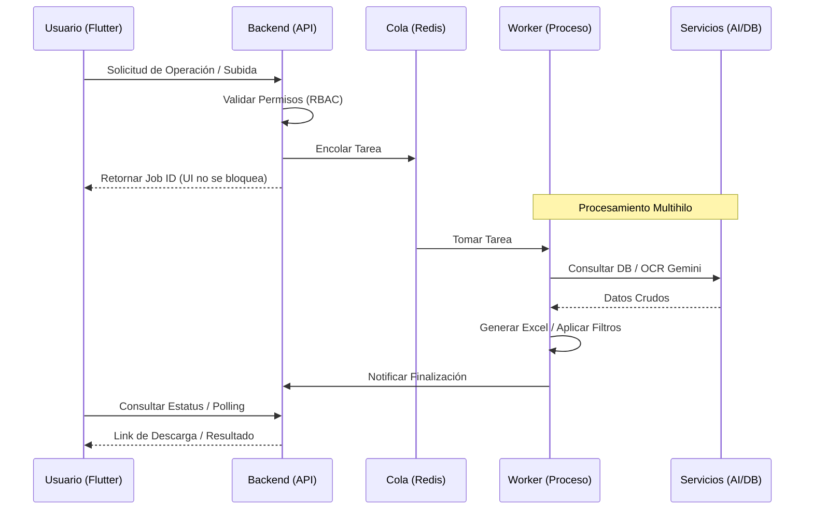

# Informe de Factibilidad Técnica: Aplicación Centralizada "Fibex One" (Flutter Desktop)

## Personas involucradas o departamentos a contactar:

*   **Auditoría interna:** Validación de procesos de trazabilidad y materiales.
*   **Gestión y procesos:** Definición de flujos operativos y reglas de negocio.
*   **Conciliaciones:** Usuarios clave del módulo de conciliación bancaria y OCR.
*   **Administración:** Gestión de reportes financieros y KPIs.
*   **Cobranzas:** Seguimiento de pagos y recaudación.
*   **Otros:** Departamentos técnicos de TI e infraestructura.

## Descripción del proyecto:

### Resumen ejecutivo
El proyecto evoluciona de la simple migración de herramientas aisladas hacia la creación de una **Súper Aplicación Centralizada ("Fibex One")**. Esta plataforma unificará el ecosistema de software de Fibex (integrando tanto el actual `filter_system` como las capacidades de `SAE Plus.exe`) bajo una arquitectura única de escritorio en **Flutter**. El objetivo es proporcionar una consola operativa total para todos los departamentos (Auditoría, Conciliaciones, Administración, Cobranzas), eliminando la deuda técnica de Electron, protegiendo los accesos mediante RBAC y optimizando el manejo de datos masivos mediante un motor de filtrado avanzado y un gestor de descargas inteligente.

### Consolidación de Ecosistemas (Filter System + SAE Plus.exe)
La nueva arquitectura absorberá las funcionalidades de ambas plataformas actuales:
*   **Módulo de Procesamiento Inteligente (ex Filter System):** OCR con Gemini, auditorías de trazabilidad ONT y procesamiento masivo de Excel/PDF.
*   **Módulo de Reportes Administrativos (ex SAE Plus.exe):** Generación de reportes de cobranza, conciliación y estados de cuenta con conexión directa a base de datos.

### Limitaciones de la arquitectura actual (Consolidada)
1.  **Dualidad de Tecnologías:** Mantenimiento de aplicaciones separadas en React (Web) y Electron (Desktop), duplicando esfuerzos de despliegue.
2.  **Vulnerabilidad de Seguridad:** Landing pages desprotegidas e inyecciones SQL detectadas en reportes por interpolación directa de parámetros.
3.  **Sobrecarga de Electron:** Consumo excesivo de RAM (~250MB por instancia) para tareas que Flutter realiza con <50MB.
4.  **Fragmentación de Descargas:** Los archivos generados se dispersan en carpetas temporales sin un control centralizado ni integración nativa con la nube (Drive).
5.  **Filtros Rígidos:** La incapacidad de realizar filtrados complejos y dinámicos sobre operaciones cruzadas (SAE vs SmartOLT) limita la capacidad de análisis rápido.

---

## ANÁLISIS TÉCNICO

### Especificaciones técnicas
*   **Frontend (Escritorio):** **Flutter Desktop (Windows/macOS/Linux)**. Compilación AOT (Ahead-of-Time) para un rendimiento nativo, eliminando el runtime de Chromium.
*   **Backend Centralizado:** Arquitectura de alto rendimiento basada en **Dart (Server-side)**. Permite el uso de un stack unificado, compartiendo modelos de datos y lógica de validación entre cliente y servidor.
*   **Gestor de Descargas Inteligente:** Módulo centralizado para el manejo de archivos generados, con limpieza automática de temporales e integración segura con Google Drive API.
*   **Motor de Filtrado Complejo:** Capacidad de aplicar filtros lógicos multinivel (Exacto, Difuso, Sufijos) sobre millones de registros en memoria mediante hilos de ejecución aislados.
*   **Procesamiento Multihilo:** Uso de **Isolates (Dart)** para ejecutar tareas pesadas de filtrado y OCR en hilos independientes, maximizando el uso de CPU sin bloquear la concurrencia.
*   **Base de Datos Segura:** PostgreSQL con parámetros preparados (eliminando riesgos de inyección SQL detectados en la arquitectura anterior).
*   **IA:** Integración continua para OCR y análisis predictivo.

---

### Módulos Estrella de la "Aplicación"

#### 1. Gestor de Descargas Unificado
A diferencia del sistema actual donde los archivos se pierden en carpetas temporales, "Fibex One" implementará:
*   **Consola de Historial:** Un panel central donde cada usuario ve sus archivos generados (Excel, PDF, ZIP), su estado de procesamiento y tamaño.
*   **Pipeline de Destino:** Capacidad de configurar reglas de guardado automático (Local, Servidor de Archivos o Google Drive) con un solo clic.
*   **Auto-Limpieza Inteligente:** Sistema que purga archivos temporales locales después de N días para mantener la salud del almacenamiento del equipo.

#### 2. Motor de Filtrado y Operaciones Complejas
Para manejar la "Big Data" de Fibex sin bloquear la interfaz:
*   **Procesamiento en Segundo Plano (Isolates):** Los filtros pesados sobre miles de registros se ejecutan en hilos separados de Flutter (Isolates), garantizando que la aplicación nunca se "congele" durante el cálculo.
*   **Exportación Segmentada:** Opción de exportar solo los resultados filtrados hacia cualquiera de los módulos de la aplicación.

### Planteamiento del problema
Fibex Telecom maneja volúmenes masivos de datos operativos (comprobantes, notas de servicio, inventario ONT) que actualmente se procesan mediante herramientas web dispersas. La falta de una plataforma centralizada genera ineficiencias operativas, riesgos de integridad de datos y una superficie de ataque innecesariamente amplia al no contar con perímetros de seguridad definidos para cada departamento.

### Alcance
*   **Unificación Total:** Fusión de `SAE Plus` y `Filter System` en un solo binario instalable.
*   **Módulo de Descargas Centralizado:** Historial de archivos generados, gestión de carpetas de destino y subida automática.
*   **Filtros de Operaciones Complejas:** Herramienta de búsqueda global que permite filtrar por múltiples criterios (Fecha, Franquicia, Estado de Red, Referencia Bancaria) a través de todos los módulos.
*   **Seguridad RBAC & Auditoría:** Control total de quién puede generar reportes de cobranza vs quién puede auditar materiales.
*   **Intervención Humana Controlada:** Interfaces dedicadas para la validación de discrepancias detectadas por IA.

### Limitaciones
*   **Dependencia de APIs Externas:** El rendimiento del OCR sigue sujeto a las cuotas y latencia de Google Gemini.
*   **Curva de Aprendizaje:** Transición de entorno Web a una aplicación de escritorio para el usuario final.
*   **Esfuerzo de Migración:** Requiere la refactorización de lógica compleja de procesamiento de archivos para adaptarla al modelo asíncrono/multihilo.

### Conclusión Técnica
La creación de una "Aplicación" es la solución definitiva para Fibex. No solo resuelve los problemas de rendimiento (ahorro del 70% de RAM vs Electron) y seguridad (eliminación de inyecciones SQL y accesos anónimos), sino que proporciona un entorno de trabajo unificado y profesional para todos los departamentos. La tecnología Flutter permite esta centralización con un solo código fuente mantenible a largo plazo.

### Recomendación Ejecutiva
Proceder con la unificación inmediata de ambos proyectos. La inversión en una sola plataforma robusta reducirá los costes de mantenimiento a la mitad y eliminará los riesgos críticos de seguridad identificados.

### Veredicto de Viabilidad
**EXTREMADAMENTE VIABLE (ESTRATÉGICO).** La consolidación no es solo una mejora técnica, es una transformación operativa.

---

## DIAGRAMAS DE PROCESO Y ARQUITECTURA

### 1. Arquitectura de la Aplicación Centralizada

### 2. Flujo de Procesamiento Asíncrono

---

## PROPUESTA DE FASES DE CONSOLIDACIÓN

Para garantizar una transición sin fricciones, se propone un despliegue en 4 fases estratégicas:

### Fase 1: Cimientos y Seguridad Centralizada (Semanas 1-2)
*   **Infraestructura:** Setup del proyecto Flutter Desktop y el nuevo Backend centralizado.
*   **Seguridad:** Implementación del módulo de Autenticación (Login) y esquema de roles RBAC.
*   **DB:** Diseño y migración de la base de datos Multitenant para usuarios y logs de auditoría.

### Fase 2: Unificación Administrativa (Semanas 3-5)
*   **Reportes SAE:** Migración de la lógica de `SAE Plus.exe` (Cobranza, Conciliación, Estados de Cuenta).
*   **Motor de Filtrado:** Implementación de la versión 1.0 del motor de búsqueda y filtros complejos sobre la base de datos.
*   **Descargas:** Lanzamiento del Gestor de Descargas básico (local).

### Fase 3: Inteligencia y Auditoría (Semanas 6-8)
*   **Procesamiento IA:** Migración de los módulos de OCR Gemini y Auditoría de Trazabilidad.
*   **Intervención:** Creación de las interfaces para la validación humana de discrepancias.

### Fase 4: Optimización y Lanzamiento (Semanas 9-10)
*   **QA:** Pruebas de estrés de procesamiento masivo y auditoría de seguridad final.
*   **UX/UI:** Refinamiento de la experiencia de usuario y temas visuales.
*   **Despliegue:** Lanzamiento gradual por departamentos (Canary Release).
